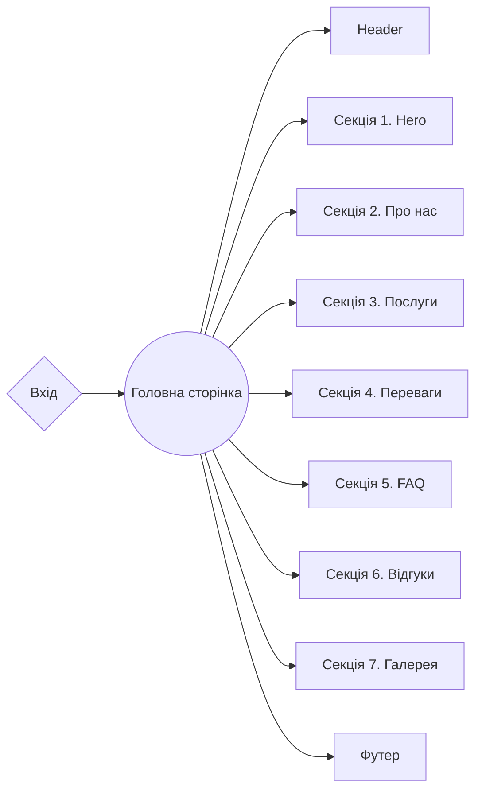

# GIFT-SHOP :tada::white_flower::cherry_blossom::candy:

**[Переглянути живу сторінку](https://gift-studio.vercel.app/)**

---


## Опис проєкту

- **Назва проєкту**: Gift-shop
- **Цілі проєкту**:
- Створення позитивного особистого бренду
- Залучення нових клієнтів / партнерів
  - Просування послуг через веб-сайт
  - Інформування споживачів
- **Цільова аудиторія**: Вік: 12-45+
- **Стать**: Жіноча/чоловіча
- **Обсяг продукту**: Розробка багатосторінкового веб-сайту для компанії
  "Gift-Shop", основна сфера діяльності якої - створення унікальних та смачних
  подарункових букетів в подарунок та для святкових подій.

## 🛠️ Створення проєкту

**Gift-shop** - це проєкт [Next.js](https://nextjs.org/) , збудований за
допомогою
[`create-next-app`](https://github.com/vercel/next.js/tree/canary/packages/create-next-app).

## Особливості

- **Оптимізація**: Сайт оптимізований для швидкого завантаження, що забезпечує
  користувачам швидкий доступ до інформації.
- **Модульність та перевикористання**: Продукт побудований з використанням
  компонентного підходу, що робить код модульним і дозволяє використовувати
  компоненти на різних сторінках та розділах проєкту. Це спрощує обслуговування
  сайту та розширення його функціональності.
- **Лінтери та форматування**: Використання інструментів, таких як Prettier та
  ESLint, допомагає дотримуватися стандартів коду, забезпечує єдиний стиль та
  виявляє можливі проблеми в коді.
- **Адаптивність**: Сайт є адаптивним, що дозволяє створювати динамічні та
  інтерактивні інтерфейси користувача без перезавантаження сторінки. Це збільшує
  залучення та взаємодію користувачів.
- **Зручне управління контентом**: Система управління контентом має інтуїтивний
  інтерфейс, що спрощує процес оновлення та редагування контенту. Ви можете
  легко вносити зміни в текст, зображення та інший контент без спеціальних знань
  в області веб-розробки.
- **Доступність**:
  - Інтуїтивний дизайн;
  - Семантична верстка;
  - Інтерфейс, зручний для мобільних пристроїв;
  - Ресурс доступний для будь-якого Інтернет-з'єднання;

## 💼 Панель керування адміністратора Sanity Studio 💼

Для управління вмістом та конфігурацією вашого додатка Next.js, перегляньте
додаткову документацію з
[Sanity Studio](https://docs.google.com/document/d/14rdHNc4vb7Z7vKZZglbxdZAlBCxMK1AByJ6xttbFOlI/edit?usp=sharing).

---

### Структура проєкту

<details>

<summary><b>Організація проєкту та Розташування Файлів: </b></summary>
<br/>

```

|-- public -> статичні файли
|-- admin -> директорія із базовим кодом CMS
  |-- requests --> отримання динамічних даних
  |-- schemas --> схеми моделювання
  даних CMS
|-- src -> директорія із вихідним кодом основної
програми
  |-- app ->  маршрутизація
    |-- (site) --> група маршрутів для
    головного інтерфейсу
    |-- (studio) --> група маршрутів для вбудованої CMS
  |-- components -> директорія зі зручними компонентами
    |-- NameComponent -> базові компоненти
    секцій/блоків (слайдер і т.д.)
    |-- ui -> невеликі, зручні компоненти
    (кнопки, логотипи і т.д.)
      |-- NameComponent -> папка для кожного компонента
        |-- NameComponent.tsx -> основний компонент
        |-- index.ts -> файл для повторного
        експорту
        |-- types.ts -> файл для спеціальних типів компонентів (параметри)
  |-- layout -> компоненти, які використовуються як основний шаблон
  |-- sections ->
  директорія із компонентами секцій
  |-- data -> статичні дані для проєкту (json)
  |-- types -> директорія
  зі зручними визначеннями типів
  |-- utils -> додаткові, зручні функції для сторінок та компонентів
  |-- constants -> директорія із константами

```

</details>

## 🧩 Технології

### Frontend

- **Next.js**: Фреймворк React для розробки високопродуктивних веб-сайтів та
  застосунків.
- **TypeScript**: Мова програмування, яка додає статичний аналіз типів до
  JavaScript.

### Стилізація

- **Tailwind CSS**: Утиліта для створення власних дизайнів інтерфейсу,
  використовуючи лише HTML та CSS.

### CMS

- **Sanity**: Headless CMS для створення, управління та доставки цифрових
  змістів.

### Бібліотеки

- **Swiper**: Сучасна бібліотека для роботи зі слайдерами та каруселями.
- **React Scroll**: Бібліотека для реалізації плавного прокручування до розділів
  сайту.

### Структура проєкту



## 💼 API компонентів 💼

Кожен компонент має свій власний API. Ви можете знайти його в папці компонента.
Це список деяких загальних компонентів та їх API.

- ### SectionHeading

Наявний текст матиме тег `h2`, нижній марджін 24px та буде aкцентного кольору в
наступних розмірах: (екран до 768px) - 48/60.48/400 Caveat, (екран від 768 до
1280px) 56/70.56/400 Caveat, (екран від 1280px) 64/80.64/400 Caveat

| Prop         | За замовчуванням | Опис                                                             |
| ------------ | ---------------- | ---------------------------------------------------------------- |
| `title `     | `undefined`      | обов'язковий, рядок - текст заголовку секції,                    |
| `className ` | `undefined`      | не обов'язковo, при необхідності додатково стилізувати компонент |

- ### ButtonLink

Компонент `ButtonLink` створюється за допомогою `Link` з
бібліотеки`react-scroll`, має стилізований варіант і виконує плавний скрол до
`targetName` за допомогою`click`. Рендериться як тег `a`.

| Prop         | За замовчуванням | Опис                                                                                                                                                                                                                                                                                               |
| ------------ | ---------------- | -------------------------------------------------------------------------------------------------------------------------------------------------------------------------------------------------------------------------------------------------------------------------------------------------- |
| `label `     | `undefined`      | обов'язковий, рядок - текст кнопки, буде 16/19.5/700                                                                                                                                                                                                                                               |
| `targetName` | `undefined`      | обов'язковий, рядок - містить ID секцї до котрої здійснюється плавний скролл                                                                                                                                                                                                                       |
| `variant `   | `undefined`      | обов'язковий, рядок: `primary`- кнопка буде акцентного кольору та білим шрифтом, ховер теж присутній, `outline` - кнопка буде білого кольору з акцентним бордером 1px та акцентим кольором, ховер присутній, `ghost` - тільки текст, ховер присутній, текст кнопки, буде 24/29/400 чорного кольору |
| `className ` | `undefined`      | опціонально, при необхідності додатково стилізувати компонент                                                                                                                                                                                                                                      |
| `tabIndex `  | `0`              | опціонально, при необхідності додатково вказати активний '0' чи пасивний '-1' для фокусу компонент                                                                                                                                                                                                 |

- ### Slider

Компонент `Slider` створений за допомогою бібліотеки `swiper`. Важливо давати
для `section` властивість `position: relative`.Це необхідно для того, щоб
`Slider` міг вийти за межі `container`. За назвою розділу ви зможете редагувати
власні стилі для вашого `sectionName`-слайдера і `sectionName`-слайду. Базова
висота для кожного Slider додана до global.css. Щоб приховати чи показати
компонент, ви можете його обернути в `div` і встановити умови і стилі в
classNames.

| Prop       | За замовчуванням | Опис                                                                                                                                                                                                    |
| ---------- | ---------------- | ------------------------------------------------------------------------------------------------------------------------------------------------------------------------------------------------------- |
| `section ` | `undefined`      | обов'язковий, потрібно вказати назву секції для котрої обирається слайдер: `services`, `features`, `feedback` or `gallery` по ній будуть застосовані кількість елементів слайдеру згідно точок перелому |
| `slides`   | `undefined`      | обов'язковий, масив слайді `ReactNode` для перебору і інтеграції до слайдеру                                                                                                                            |

- ### NavBar
  Компонент є навігаційним тегом, що містить список прив’язних посилань для
  навігації між розділами. Використовується в `footer`, `header` та `MobileMenu`
  сайту .

| Prop           | За замовчуванням | Опис                                                                                                                                                                          |
| -------------- | ---------------- | ----------------------------------------------------------------------------------------------------------------------------------------------------------------------------- |
| `isMobile `    | `undefined`      | обов’язковий, якщо значення `true`, застосовує стилі для мобільної версії, які використовуються в мобільному меню. Якщо `false`, компонент прихований до 1280px ширини екрану |
| `handleClick ` | `undefined`      | не обов'язковo, прокидається наверх від `ButtonLink`, необхідний для закриття мобільного меню під час натискання на елемент навігації                                         |
| `className `   | `undefined`      | не обов'язковo, якщо необхідно додати деякі зміни через стилі                                                                                                                 |

- ### MobileMenu

Мобільне меню з’являється, коли користувач натискає на `Mobile Btn` компонент.
З'являється лише тоді, коли ширина екрана є до 1280px. Містить основну навігацію
та `PhoneLink` компонент.

| Prop           | За замовчуванням | Опис                                                                                                                           |
| -------------- | ---------------- | ------------------------------------------------------------------------------------------------------------------------------ |
| `isMobile `    | `undefined`      | обов’язковий, прокидається наверх від компоненту `NavBar`                                                                      |
| `handleClick ` | `undefined`      | не обов'язковo, прокидається з `NavBar`, пропс необхідний для закриття мобільного меню при натисканні на навігаційне посилання |
| `className `   | `undefined`      | не обов'язковo, використовується в `header` для того, щоб додати трансформацію вздовж горизонтальної осі за умовою             |

- ### MobileBtn

Кнопка для відкриття та закриття мобільного меню. Залежно від `true` чи `false`
`isMobileMenuShown` змінює іконку та закриває або відкриває мобільне меню.

| Prop                 | За замовчуванням | Опис                                                                                                                                                                                                                    |
| -------------------- | ---------------- | ----------------------------------------------------------------------------------------------------------------------------------------------------------------------------------------------------------------------- |
| `isMobileMenuShown ` | `undefined`      | необхідне, `boolean` тип. Якщо значення `true`, генерує в кнопці ікноку закриття і відповідний текст для `aria-label`. Якщо значення `false`, генерує в кнопці ікноку бургер-меню і відповідний текст для `aria-label`. |
| `handleClick `       | `undefined`      | необхідно, колбек функція, яка нічого не повертає. Використовується в `header` для відкриття та закриття мобільного меню                                                                                                |

- ### PhoneLink

Компонент посилання містить номер телефону для контакту. Він використовується
окремо в `MobileMenu` шириною до 768 пікселів і в `header` при ширині екрану від
768 пікселів. Імпортується в компонент ContactsLink, розташований у `footer`.
Містить атрибут `href` із номером телефону та атрибут `aria-label` з описом
кнопки. Посилання огортається навколо іконки телефону та номера телефону.

| Prop           | За замовчуванням | Опис                                                          |
| -------------- | ---------------- | ------------------------------------------------------------- |
| `customStyle ` | `undefined`      | не обов'язковo, якщо необхідно додати деякі зміни через стилі |

- ### ContactsList

Компонент списку контактів містить компонент `PhoneLink` із номером телефону і
посилання `a` на електронну пошту. Використовується в `footer`. Посилання на
пошту містить атрибут `href` з адресою електронної пошти та атрибутом
`aria-label` з описом кнопки. Посилання огортається навколо іконки пошти та
електронної адреси.

| Prop               | За замовчуванням | Опис                                                                    |
| ------------------ | ---------------- | ----------------------------------------------------------------------- |
| `customListStyle ` | `undefined`      | не обов'язковo, якщо необхідно додати деякі змін для списку через стилі |

- ### SocialMediaList

Список `ul`, що містить посилання на соціальні мережі. Використовується в
`footer`. Елемент списку містить компонент `SocialLink`, який огортає іконку
відповідної соціальної мережі.

| Prop               | За замовчуванням | Опис                                                                    |
| ------------------ | ---------------- | ----------------------------------------------------------------------- |
| `customListStyle ` | `undefined`      | не обов'язковo, якщо необхідно додати деякі змін для списку через стилі |

- ### SocialLink

Компонент, що містить посилання на соціальну мережу. Використовується в
`SocialMediaList` та в компоненті `FaqListItem`. Компонент містить `href`
атрибут із посиланням, `target` атрибут із властивістю `"_blank"`, `rel` атрибут
із властивістю `"noopener noreferrer nofollow"`, атрибут `title` з prop
`username` та атрибутом `tabIndex` з prop `tabIndex`. За замовчуванням він
містить посилання на Instagram зі змінної `InstagramLink`, якщо `SocialLink`
prop є `undefined`.

| Prop          | За замовчуванням | Опис                                                                                                                                                 |
| ------------- | ---------------- | ---------------------------------------------------------------------------------------------------------------------------------------------------- |
| `username `   | `undefined`      | потрібно, додається до змінної link за допомогою методу `concat()` для створення посилання на користувача в Instagram                                |
| `className `  | `undefined`      | не обов'язковo, якщо необхідно додати деякі зміни через стилі                                                                                        |
| `socialLink ` | `undefined`      | не обов'язковo, `string` для атрибута `href`, якщо його немає, використовується змінна `InstagramLink`                                               |
| `tabIndex `   | `0`              | не обов'язковo, має тип `number`. Використовується як індекс для атрибуту `tabindex`                                                                 |
| `children `   | `undefined`      | не обов'язковo, якщо немає prop, з’являється текст з іменем користувача Instagram. Використовується в `SocialMediaList` щоб огорнути іконки соцмереж |
| `aria-label ` | `undefined`      | не обов'язковo, додає опис до кнопки `aria-label`                                                                                                    |

- ### Logo

Компонент, що містить посилання на головну стоірнку, яке огортає логотип
компанії. Використовується в `header` та в `footer` проєкту. Компонент містить
`href` атрибут із посиланням на головну сторінку, та `aria-label`, який додає
опис до кнопки. Використовує утиліту `cn()` для поєдання класів tailwind та з
можливими додатковими класами

| Prop         | За замовчуванням | Опис                                                                |
| ------------ | ---------------- | ------------------------------------------------------------------- |
| `className ` | `''`             | не обов'язковo, використовується для додаткої стилізації компоненту |

- ### SanityImage

Компонент, що є зображенням, імпортує в себе `Image` з `"next/image"`.
Використовується в проєкті для передавання даних для зображення з амін-панелі
`Sanity`. Містить в собі атрибути: `src` значення приходить з prop `image.src`,
`alt` значення приходить з prop `image.alt`, `placeholder` яке має стале
значення `"blur"` `blurDataURL`значення приходить з prop`image.lqip`. Може
приймати будь-яку кількість інших пропсів.

| Prop          | За замовчуванням | Опис                                                                                                                                                                                |
| ------------- | ---------------- | ----------------------------------------------------------------------------------------------------------------------------------------------------------------------------------- |
| `image `      | `undefined`      | обов'язковo, об'єкт, що містить в собі поля `src`, `alt`, `lquip`.                                                                                                                  |
| `imageProps ` | `undefined`      | не обов'язковo, додаткові параметри, які передаються через оператор `...`, використовуються для використання додаткових атрибутів, окрім `src`, `alt`, `placeholder`, `blurDataURL` |

- ### FeedbackCard

Компонент, що містить на фронтовій частині `SanityImage`- картку з картинкою
товару, частину тексту відгуку та кнопку відкриття. При кліці на кнопку картка
обертається на задню частину, яка містить заголовок та повний текст відгуку,
кнопку закриття картки, що обертає картку назад. Використовується в
`FeedbackSlider` що в секції `Feedback`. Картка приходить з адмін-панелі
`Sanity`. За замовучанням картка лицевою частиною до користувача.

| Prop             | За замовчуванням | Опис                                                                                                                                                                                                                    |
| ---------------- | ---------------- | ----------------------------------------------------------------------------------------------------------------------------------------------------------------------------------------------------------------------- |
| `content `       | `undefined`      | обов'язковo, об'єкт, що містить в собі поля `image`- об'єкт з даними для `src`, `alt` зображення відгуку , `text` - повний текст відгуку, `reviewName` - заголовок відгуку від клієнта.                                 |
| `isActiveCard `  | `undefined`      | обов'язковo, `boolean`, використовується в `FeedbackSlider` для застосування стилів обертання картки, якщо `true` - обертає картку частиною з повним текстом відгуку, `false` - картка обертається фрнотальною частиною |
| `setActiveCard ` | `undefined`      | обов'язковo, callback функція для кнопки закриття та відкриття, прокидується в `FeedbackSlider` для зміни стана `isActiveCard` на `true` чи `false`                                                                     |

- ### Slider

Компонент слайдеру, написаний за допомогою бібліотеки `swiper/react`.
Використовується в `FeedbackSlider`,`GallerySlider`, для перегляду карток
відгуків, чи галереї користувачем. Огортає компонент імпортований з бібліотеки
`SwiperSlide` тегом `ul`, в залежності від стилізації показує різну кількість
слайдів за раз, гортає циклічно. Приймає від батька масив об'єктів `slides` та
рядок `section`. Всередині `SwiperSlide`, що є `li`, повертається при
перебиранні масиву `slides`.

| Prop       | За замовчуванням | Опис                                                                                                                                                                                         |
| ---------- | ---------------- | -------------------------------------------------------------------------------------------------------------------------------------------------------------------------------------------- |
| `section ` | `undefined`      | обов'язковo, приймає рядок: "feedback", "advantages", "gallery" або "services". Використовується для використання різних налаштвань та стилів в `className` в залежності від переданої назви |
| `slides `  | `undefined`      | обов'язковo, `array`, який перебирається в компоненті для створення слайдів для `Slider`                                                                                                     |

- ### SliderNavButton

Компонент `SliderNavButton` використовується для створення кнопок навігації у
слайдері. Цей компонент приймає напрямок (ліво або право) та функцію `onClick`
для обробки події кліку користувача. Використовує іконку стрілки зображену в
компоненті `ArrowIcon`. В залежності від значення `direction` записує в
`aria-label` відповідний опис.

| Prop        | За замовчуванням | Опис                                                                                       |
| ----------- | ---------------- | ------------------------------------------------------------------------------------------ |
| `direction` | `"left"`         | Опціонально. Рядок, що вказує напрямок кнопки навігації. Може бути `"left"` або `"right"`. |
| `onClick`   | `undefined`      | Обов'язково. Функція, яка викликається при кліку на кнопку навігації.                      |

- ### FeedbackSlider

Компонент `FeedbackSlider` використовується для створення слайдеру відгуків. Цей
компонент є обгорткою для компонента `Slider` і приймає масив об'єктів відгуків
для створення слайдів. Компонент `FeedbackSlider` використовує компонент Slider
для створення слайдів, тому можна використовувати всі props, які приймає
компонент `Slider`.

| Prop         | За замовчуванням | Опис                                                                                                                                                      |
| ------------ | ---------------- | --------------------------------------------------------------------------------------------------------------------------------------------------------- |
| `feedbacks ` | `undefined`      | обов'язково. Масив об'єктів відгуків, де кожен об'єкт містить необхідні властивості для відображення в слайдері, наприклад, `id`, `author`, `text`, тощо. |

### GallerySlider

Компонент `GallerySlider` використовується для створення слайдера галереї. Цей
компонент отримує дані з галереї, використовуючи функцію `fetchGallery`, і
генерує слайди за допомогою компонента `SanityImage`. Слайдер огортається
компонентом `Slider`. Компонент `GallerySlider` не приймає зовнішніх props.
Однак він залежить від данних, отриманих з `fetchGallery`, та використовує
`Slider` для створення слайдів.

- ### AdvantagesItem

Компонент `AdvantagesItem` використовується для відображення окремого елемента в
`Advantages`. Цей компонент отримує дані про перевагу та відображає її у вигляді
іконки, заголовку та опису.

| Prop    | За замовчуванням | Опис                                                                                                                       |
| ------- | ---------------- | -------------------------------------------------------------------------------------------------------------------------- |
| `data ` | `undefined`      | Обов'язково. Об'єкт даних про перевагу, що містить `imageName` (назва іконки), `title` (заголовок) та `description` (опис) |

### AdvantagesItem

Компонент `FaqListItem` використовується для відображення окремого пункту FAQ.
Компонент може мати активний та неактивний стан, а також містить соціальні
посилання в тексті відповіді. Функція `handleKeyDown` використовується для
обробки клавіш `"Space"` та `"Enter"` для зміни стану активності пункта FAQ.
Властивість `answer` має можливість містити соціальні посилання в форматі
@social_link, які будуть виведені як компонент `SocialLink`.

| Prop        | За замовчуванням | Опис                                                                                                            |
| ----------- | ---------------- | --------------------------------------------------------------------------------------------------------------- |
| `isActive`  | `false`          | Опціонально. Змінна, що вказує, чи є пункт FAQ активним. Впливає на відображення стилів та текстового контенту. |
| `question`  | `undefined`      | Обов'язково. Текст питання в пункті FAQ                                                                         |
| `answer`    | `undefined`      | Обов'язково. Текст відповіді в пункті FAQ. Може містити соціальні посилання в форматі @social_link.             |
| `setActive` | `undefined`      | Обов'язково. Функція, що викликається при кліку на пункт FAQ.                                                   |

### FaqList

Компонент `FaqList` використовується для відображення списку пунктів FAQ. Кожен
пункт має своє питання та відповідь. Включає можливість розгортання пунктів для
отримання деталей. Імпoртує в себе `FaqListItem` .

| Prop   | За замовчуванням | Опис                                                                                                                                    |
| ------ | ---------------- | --------------------------------------------------------------------------------------------------------------------------------------- |
| `data` | `false`          | Обов'язково. Масив об'єктів, кожен з яких має властивості `question` та `answer`, що представляють питання та відповідь для пункту FAQ. |

### ServiceCard

Компонент `ServiceCard` призначений для відображення картки послуги. Картка
містить зображення, назву послуги та посилання на деталізацію послуги. Даний
компонент використовує `SanityImage` та `PortableText`. Властивості `data`
`serviceUrl`: Рядок, посилання на деталізацію послуги. `image`: Об'єкт із даними
для зображення. Має властивості, такі як `url`, `width`, `height`, і т. д.
`serviceName`: Масив об'єктів або рядків, представляє назву послуги. Може
містити форматований текст або інші елементи.

| Prop                 | За замовчуванням | Опис                                                              |
| -------------------- | ---------------- | ----------------------------------------------------------------- |
| `data`               | `undefined`      | Обов'язково. Об'єкт з даними для відображення картки послуги.     |
| `wrapperCustomStyle` | `undefined`      | не обов'язковo, при необхідності додатково стилізувати компонент. |

## 📂 Деплоймент

Для розгортання цього проєкту слід виконати наступні кроки:

1. **Клонуйте репозиторій**: Використовуйте команду `git clone`, щоб склонувати
   цей репозиторій на свій комп'ютер.
2. **Встановіть залежності**: Відкрийте термінал у кореневій папці проєкту та
   запустіть команду `npm install` або `yarn install`, щоб встановити всі
   необхідні залежності.
3. Налаштуйте змінні середовища: Створіть файл `.env` у кореневій папці та
   додайте необхідні змінні середовища, які вам потрібні для проєкту, відповідно
   до файлу `.env.example`.
4. **Запустіть застосунок**: Запустіть команду `npm run dev` або `yarn dev`, щоб
   запустити проєкт на локальному сервері.
5. **Розгортання**: Для розгортання цього проєкту на виробничому сервері
   використовуйте платформи хостингу, такі як Vercel, Netlify або інші.

## ☎️ Контакти

**SoftRyzen** готовий відповісти на ваші питання та надати додаткову інформацію:

- **Веб-сайт**: [softryzen.com](https://softryzen.com/)
- **Телефон**: <a href="tel:+380979769625">+380979769625</a>
- **Електронна пошта**: [services@softryzen.com](mailto:services@softryzen.com)

- **Канал YouTube:**:
  [https://www.youtube.com](https://www.youtube.com/watch?v=_X7NLwgdfgI)
